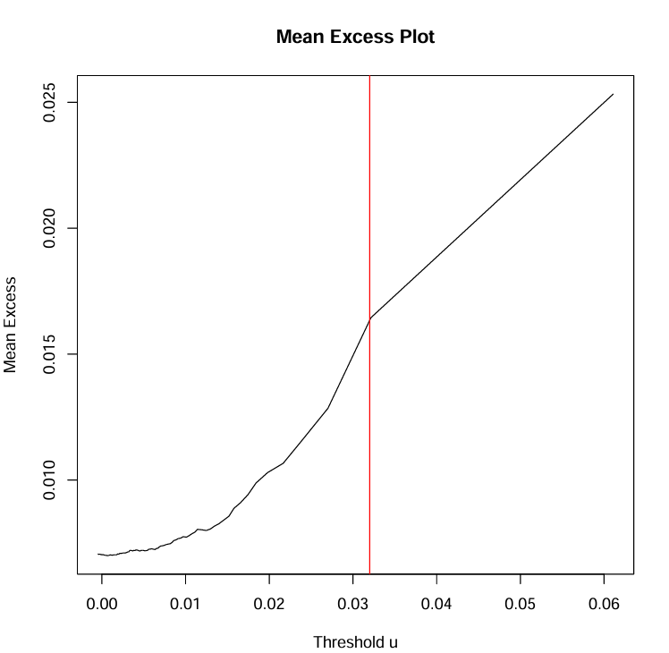

# 📈 Extreme Value Theory and Risk Estimation in R

This repository presents a complete implementation of the **Peaks-over-Threshold (POT)** methodology and **Generalized Pareto Distribution (GPD)** modeling using R. It includes:

- Mean excess plots for threshold selection  
- GPD parameter estimation with MLE and confidence intervals  
- CI coverage analysis for shape parameter ξ under varying t-distributions  
- Bootstrap-based estimation of **Value-at-Risk (VaR)** and **Expected Shortfall (ES)**  
- Real-world application to **S&P 500 daily loss data (1957–2023)**

---

## 🗂 Project Files

| File | Description |
|------|-------------|
| `Extreme-Value-Theory-and-Risk-Estimation.Rnw` | Main R + LaTeX source |
| `Extreme-Value-Theory-and-Risk-Estimation.pdf` | Compiled report |
| `sp500_full_1957_2023.csv` | S&P 500 return dataset |

---

## 📌 Topics Covered

### 1️⃣ Mean Excess Plot & GPD Parameter Estimation

- Simulated data from t-distributions (ν = 1.1, 2, 3, 4)
- Estimated GPD shape parameter ξ via MLE
- Constructed 95% confidence intervals using the Hessian matrix


**Estimated Shape Parameter ξ and 95% CI:**

| ν     | ξ     | Lower   | Upper   |
|-------|--------|---------|---------|
| 1.1   | 0.9091 | 0.7593  | 1.0739  |
| 2     | 0.5000 | 0.3678  | 0.5834  |
| 3     | 0.3333 | 0.1867  | 0.3574  |
| 4     | 0.2500 | 0.1412  | 0.3662  |

---

### 2️⃣ Coverage Probabilities for ξ (500 Replications)

- Investigated empirical coverage of confidence intervals across different thresholds and ν
- Used 500 simulations per condition

**CI Coverage Table:**

| ν   | 0.80  | 0.82  | 0.84  | 0.86  | 0.88  | 0.91  | 0.93  | 0.95  | 0.97  | 0.99  |
|-----|-------|-------|-------|-------|-------|-------|-------|-------|-------|-------|
| 1.1 | 0.750 | 0.824 | 0.898 | 0.906 | 0.934 | 0.946 | 0.950 | 0.954 | 0.944 | 0.920 |
| 2.0 | 0.124 | 0.242 | 0.392 | 0.580 | 0.686 | 0.806 | 0.874 | 0.888 | 0.920 | 0.918 |
| 3.0 | 0.000 | 0.018 | 0.080 | 0.184 | 0.334 | 0.594 | 0.756 | 0.842 | 0.876 | 0.888 |
| 4.0 | 0.000 | 0.004 | 0.012 | 0.054 | 0.132 | 0.372 | 0.552 | 0.740 | 0.854 | 0.880 |

> 💡 Heavier-tailed distributions (low ν) produce better coverage at moderate thresholds.

---

### 3️⃣ VaR & ES Estimation (Parametric Bootstrap)

- Estimated VaR and ES using parametric bootstrap with 1000 samples
- Used high thresholds (p = 0.95) and extreme quantiles (e.g., α = 1/2520)

**VaR Estimates:**

| α       | Lower     | Upper     |
|---------|-----------|-----------|
| 1/252   | 0.0355    | 0.0412    |
| 1/1260  | 0.0549    | 0.0748    |
| 1/2520  | 0.0649    | 0.0961    |

**ES Estimates:**

| α       | Lower     | Upper     |
|---------|-----------|-----------|
| 1/252   | 0.0478    | 0.0653    |
| 1/1260  | 0.0701    | 0.1199    |
| 1/2520  | 0.0819    | 0.1555    |

---

### 4️⃣ Application to S&P 500 Losses (1957–2023)

- Applied POT method to empirical daily loss data
- Threshold selected using mean-excess plot: **u₀ = 0.032**
- 


- Estimated ξ across several thresholds


**Selected ξ Estimates:**

| Threshold | ξ     | Lower   | Upper   |
|-----------|--------|---------|---------|
| 0.0200    | 0.2764 | 0.1570  | 0.3957  |
| 0.0293    | 0.4309 | 0.1592  | 0.7026  |
| 0.0387    | 0.2687 | -0.0671 | 0.6044  |
| 0.0573    | 0.3162 | -0.2693 | 0.9018  |
| 0.0872    | 1.2020 | -0.5811 | 2.9852  |

> 📈 Lower thresholds yield more stable estimates of ξ. At high thresholds, variance increases significantly.

---

### 5️⃣ Vanilla Bootstrap on Non-Extreme α = 0.01

- Used `{bootstrap}` package’s `bcanon` function
- Bootstrap replicates: 100
- Quantile level: α = 0.01

**Coverage Results (Empirical):**

| Measure | Coverage |
|---------|----------|
| VaR     | 100%     |
| ES      | 100%     |

---

## ✅ Key Conclusions

- **Threshold Selection Matters:** Extreme value theory works best with carefully selected thresholds. Too low = bias, too high = variance.
- **Heavier-Tailed Distributions (low ν)** provide more reliable CI coverage.
- **Bootstrap is powerful** for both extreme and moderate quantile estimation. Parametric works for extrapolation; vanilla for robust inference.
- **Real-World Loss Modeling:** GPD fits well to S&P 500 loss tail — confirming its relevance in financial risk estimation.

---

## 💻 How to Compile

To reproduce this analysis:

1. Open `Extreme-Value-Theory-and-Risk-Estimation.Rnw` in **RStudio**
2. Go to: `Tools → Global Options → Sweave → Use knitr`
3. Click **Knit to PDF**

### Required R Packages

```r
install.packages(c("knitr", "statmod", "bootstrap"))
